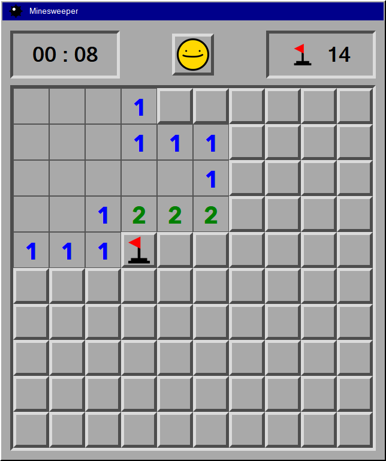

# Minesweeper
A recreation of Minesweeper, the single-player puzzle game commonly bundled with operating systems.

## General Info 
I made this with vanilla Javascript with an HTML frontend during week 4 of my software development course at _nology. 

I absolutely love Minesweeper and when tasked with making a Javascript game in a week I jumped at the chance. It seemed like a great balance between something I could make in a week and something that would challenge me - I had never used recursion before, and it was a good chance to make use of classes, which I had never needed on my earlier, smaller projects.

Design-wise I tried to keep it as similar to the Win95 version as possible. The smiley face was a must. I even tracked down Fixedsys, a typeface used on DOS Windows systems, though I didn't end up using it as a bitmap font stuck out a bit amongst the clean lines of the rest.

### Technologies used
* Javascript ES6
* HTML 5
* CSS 3/SCSS
* jest

### Rules
Minesweeper is simple but challenging. You are given a grid of 100 tiles, with 15 containing bombs. 

* Left click to reveal a tile.
* The number on each tile corresponds to how many bombs are on the 8 adjacent tiles.
* If a tile has no adjacent bombs, the game will recursively search until it finds surrounding tiles with adjacent bombs.
* If you suspect a tile has a bomb on it, right click to place a flag on it.
* If you manage to reveal every tile that contains a bomb, you have won the game.

## How it works

### Under the hood

Each tile on the board is represented by a `Cell` object which stores information about its current state. 
````javascript
class Cell {
  constructor(column, row) {
    this.column = column;
    this.row = row;
    this.id = `cell${this.row}${this.column}`;
    this.isBomb = false;
    this.hasFlag = false;
    this.adjacentBombCount = 0;
    this.isRevealed = false;
  }
}
````
All 100 objects are instantiated and stored in `const gameArr`, with unique identifiers for their corresponding column and row. 

These are formatted as `cell01`, `cell02` etc so they can be matched up with the HTML `id` of their corresponding `<div>` on the frontend, which can't start with a number.
````javascript
// minesweeper.js
export const createGameArray = () => {
  let tempArr = [];
  for (let row = 0; row < 10; row++) {
    tempArr[row] = [];
    for (let col = 0; col < 10; col++) {
      tempArr[row][col] = new Cell(col, row);
    }
  }
  return [].concat.apply([], tempArr);

  // scripts.js
  const gameArr = createGameArray();
};
````
We now need 15 bombs randomly placed on cells. Initially I had a simple function placing 15 bombs on a cells with a random index anywhere between 0 and 99.

The problem with this method is that it would sometimes generate the same number twice - so sometimes you'd have 15 bombs, sometimes you'd have less. The game worked fine but I felt it was not only unfair to the player, but felt a bit cheap on my part to leave what is essentially a bug in.

I created this helper function to return an array that is a super cool club where only unique numbers are allowed in. The numbers in this array are the indexes where `isBomb` will be `true`.

````javascript
export const generateRandomNumbers = () => {
  let randomNumArray = [];
  while (randomNumArray.length < 15) {
    let randomNumber = Math.floor(Math.random() * 99);
    if (randomNumArray.indexOf(randomNumber) === -1)
      randomNumArray.push(randomNumber);
  }
  return randomNumArray;
};
````
Now the bombs are placed, the adjacent cells need numbers that represent how many bombs neighbour it. 

To do this I use a function that will be reused a couple more times in the codebase.
It gets the objects that are off by one `Cell.column` or `Cell.row` and stores them in a row. 
I don't like how repetitive this function is and I plan to refactor it once I've ticked off the rest of the roadmap for this game.
````javascript
const findAdjacentCells = (cell, arr) => {
  const adjacentCellArr = [];

  adjacentCellArr[0] = arr.find(
    (object) => object.id == `cell${cell.row}${cell.column - 1}`
  );
  adjacentCellArr[1] = arr.find(
    (object) => object.id == `cell${cell.row}${cell.column + 1}`
  );
  adjacentCellArr[2] = arr.find(
    (object) => object.id == `cell${cell.row - 1}${cell.column}`
  );
  // ... et cetera
  return adjacentCellArr;
};
````

It is used in `calculateAdjacentBombCount()` to increment each `Cell.adjacentBombCount` accordingly. 

It is also used in `findOccupiedCells()`, which is what runs when a user clicks an empty square - it checks whether the adjacent cells have an `adjacentBombCount` above 0, and if not, recursively calls itself to then check the cells around them.

````javascript
export const findOccupiedCells = (currentCell, gameArr) => {
  const adjacentCells = findAdjacentCells(currentCell, gameArr).filter(
    (cell) =>
      cell != undefined && !cell.isRevealed && !cell.isBomb && !cell.hasFlag
  );
  adjacentCells.forEach((adjacentCell) => {
    if (adjacentCell.adjacentBombCount > 0 && !adjacentCell.isRevealed) {
      adjacentCell.isRevealed = true;
    } else if (
      adjacentCell.adjacentBombCount == 0 &&
      !adjacentCell.isRevealed
    ) {
      adjacentCell.isRevealed = true;
      findOccupiedCells(adjacentCell, gameArr);
    }
  });
};
````

### Setting up the HTML
With the game state now set up, it's time to render it and process the display and interactions on the frontend.

To start off, I need 100 `<div>` containers with an `id` that we can access from Javascript. I'm not going to do that by hand so I made a simple function to do it for me.

````javascript
// minesweeper.js
export const renderBoard = () => {
  let divContent = "";
  for (let i = 0; i < 100; i++) {
    divContent += `<div id='cell${padNumber(i)}' class='cell'></div>`
  }
  return divContent;
};

//scripts.js
document.getElementById("game-grid").innerHTML = renderBoard();
````

Now everything is initialised, I have to handle what happens when the user clicks on each cell.

I loop through each cell from the HTML DOM...
````javascript
document.querySelectorAll(".cell").forEach((cell) => {
````
...and immediately associate it with its corresponding `Cell` object.
````javascript
const currentCell = gameArr.find((object) => object.id == cell.id);
````
Now the objects and DOM elements are linked it's a simple case of adding click events to them and controlling what happens. Here's the logic:

### On left click
* If the user clicks an unrevealed tile bomb, trigger a `gameOver()` function that reveals all the tiles and stops them from being clickable.
* If the user clicks an unrevealed tile with an `adjacentBombCount` value and no flag, reveal the tile.
* If the user clicks an unrevealed tile with no value, run the `findOccupiedCells` function to scan the board until it finds cells with values.

### On right click
* If the user right clicks a tile with a flag and there are the same amount of flags and bombs, remove its flag.
* If the user right clicks an unrevealed tile and there are less flags than bombs, toggle whether it has a flag.

## Roadmap / Todo
This project isn't quite complete - I had a week to do it but in my spare time I will be adding:
* A start menu
* A high score system
* Multiple difficulties
* Draggable windows
* More nostalgic styling!